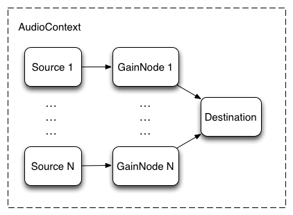

# BGM/SE再生

Web上での音声の再生は、HTML5 Audio を使う方法と、Web Audio を使う方法の二種類が存在します。

HTML5 Audio は、いわゆる<audio>タグを作成し、それを利用して、再生します。
簡単に音声が再生できる代わりに、細かい制御ができません。

Web Audio は、JavaScript の API です。細かい制御ができる代わりに、
知らなければならないことが増えます。

# HTML5 Audio
```
var element = new Audio();
element.addEventListener('canplay', function(e) {
	// 音声データの再生が可能になったら
});
element.src = "./path/to/file.mp3"; // 音声ファイルの指定
element.volume = 1.0; // 音量 0.0 ~ 1.0
element.loop = false; // ループするか否か
element.currentTime = 0; // 再生位置の指定
element.load(); // src で指定した音声ファイルの読み込みを開始する
element.pause(); // 再生の停止
element.play(); // 再生の停止
```

HTML5 Audio の使い方は上記のようになります。
ブラウザの種類にもよりますが、mp3 や wav, ogg, m4a 等が再生できます。

HTML5 Audio は非常に簡単に音声ファイルの再生を行うことができますが、
BGMのループの開始位置／終了位置を指定することができません。

そのため、ちょっとややこしい概念は出てきますが、Web Audio を使用して、
BGMやSEを再生したいと思います。

# Web Audio
```
// context 作成
var audio_context = new AudioContext();

// mp3 ファイルの読み込み
var request = new XMLHttpRequest();
request.open('GET', "./path/to/file.mp3", true);
request.responseType = 'arraybuffer';

request.send();
request.onload = function () {
	var res = request.response;
	// arraybuffer を audio 再生用に decode
	audio_context.decodeAudioData(res, function (buffer) {
		// 音量調整用の GainNode 作成
		var audio_gain = audio_context.createGain();

		// 音量
		audio_gain.gain.value = 1.0;

		// オーディオデータの出力を行う AudioBufferSourceNode 作成
		var source = audio_context.createBufferSource();

		// AudioBufferSourceNode に オーディオデータを追加
		source.buffer = buffer;

		// ループ再生する
		source.loop = true;

		// ループの再生開始位置を指定
		source.loopStart = 5.23;

		// ループの再生終了位置を指定
		source.loopEnd = 10.55;

		// AudioBufferSourceNode → GainNode を接続
		source.connect(audio_gain);

		// GainNode → destination に接続
		audio_gain.connect(audio_context.destination);

		// 再生開始
		source.start(0);

		// 再生停止
		source.stop(0);
	});
};
```

## 流れ
ゲームにおいて Web Audio を使用する際の基本的な流れです。
オーディオデータの加工やミキシング等を行うには
より複雑な流れが必要ですが、BGMの再生やSEの再生程度であれば、
下記の流れで充分です。

0. コンテクスト(AudioContext) を生成
1. オーディオデータ(ArrayBuffer) を取得(Ajax)
2. オーディオデータからPCMオーディオデータを生成
3. オーディオデータの入力点(AudioBufferSourceNode)を生成
3. 音量調整ノード(GainNode)を生成
4. オーディオデータと音量調整ノードを接続
5. 音量調整ノードと出力を接続
6. 音源のスイッチをON

## コンテクスト
Web Audioで何かする前に、まずコンテクストを作成する必要があります。
コンテキストはオーディオ処理やデコードを行うノードの作成を制御します。
(ノードについては後ほど説明します。)

コンテクストには、AudioContext(リアルタイムレンダリング)とOfflineAudioContext(オフラインレンダリング)が存在しますが、
ゲームにおいては、AudioContext を使います。

AudioContext インスタンスからは以下のノードを作ることができます。

- AudioBufferSourceNode
 - GainNode
 - ScriptProcessorNode
 - AnalyserNode
 - DelayNode
 - BiquadFilterNode
 - IIRFilterNode
 - WaveShaperNode
 - PannerNode
 - SpatialPannerNode
 - StereoPannerNode
 - ConvolverNode
 - ChannelSplitterNode
 - ChannelMergerNode
 - DynamicsCompressorNode
 - OscillatorNode

たくさんの種類がありますが、ゲームで主に使うのは、GainNode と AudioBufferSourceNode くらいです。
この2つについては、ノードの項で説明します。

## ノード

ノードとは、音声データのフィルターのようなものです。入力と出力を持ちます。
また、複数のノードを、入力と出力で接続して使います。
ノードの種類には例えば、入力された音声データにディレイをかけて出力したり、
入力された音声データの音量調整を行って出力したり、というのがあります。

一つのノードに対して複数のノードの出力／入力を接続することもできます。
接続されたノードの数はチャンネル数と呼ばれ、チャンネル数はノードの種類によって最大数がある場合もあります。


ゲームで主に使うのは、GainNode と AudioBufferSourceNode、AudioDestinationNode です。
 - AudioBufferSourceNode はオーディオデータのバイナリを出力します。
 - GainNode は音量調整を行うノードです。
 - AudioDestinationNode はオーディオの最終的な出口です。

## モジュラールーティング


ノードの項目でも説明しましたが、ノードは入力と出力を持ち、
あるノードの出力と、別のノードの入力を接続することができます。

今回は、ゲームにおける Web Audio の使用なので、以下のような
ノードの接続の仕方をすることにします。

AudioBufferSourceNode -> GainNode -> AudioDestinationNode

それでは 1つずつ解説します。

```
var source = audio_context.createBufferSource();
```

source は AudioBufferSourceNode インスタンスです。入力を持たず出力を持ちます。

```
source.buffer = buffer;
```

AudioContext.decodeAudioData により PCMデータに変換したオーディオデータを代入します。

```
source.loop = true;
source.loopStart = 5.23;
source.loopEnd = 10.55;
source.connect(audio_gain);
```

AudioBufferSourceNode インスタンスには、ループの再生や、ループ再生の開始／終了位置を設定することができます。

AudioBufferSourceNode インスタンスは使い捨てです。一度あるBGMやSEの再生に使用した後、
別のBGMやSEの再生に使用することはできません。BGMやSEの再生のたびに AudioBufferSourceNode インスタンスを
生成することになります。

```
var audio_gain = audio_context.createGain();
audio_gain.gain.value = 1.0; // 音量を 1.0 に設定
```

audio_gain は GainNode インスタンスです。入力と出力を持ちます。
入力されたデータの音量調整を行う加工を行い、それを出力します。

GainNode は一つのインスタンスを使いまわして、複数のBGMやSEを再生しても構いませんが、
音量調整やフェードイン／フェードアウト設定をいちいちリセットしなくてはならないため、
再生のたびに新しくインスタンスを生成することをオススメします。


```
audio_context.destination
```

destination はAudioDestinationNode インスタンスです。出力を持たず入力を持ちます。
オーディオの最終的な出力先です。

```
// AudioBufferSourceNode → GainNode を接続
source.connect(audio_gain);

// GainNode → destination に接続
audio_gain.connect(audio_context.destination);
```

各ノードのインスタンスが持つ connect メソッドにより、各ノードの入力と出力を接続することができます。

```
// 再生開始
source.start(0);

// 再生停止
source.stop(0);
```
AudioBufferSourceNode インスタンスの start, stop メソッドにより、再生の開始／停止ができます。
(AudioDestinationNode ではなく、AudioBufferSourceNode です。)

引数の 0 は、今すぐ再生するという意味です。N秒後に再生したい場合、引数に開始時刻を渡します。


## ガーベジコレクション
ガベージコレクション

AudioBufferSourceNodeは, 使い捨てのノードという仕様であることを解説しました. つまり, インスタンスの生成と破棄を繰り返すことが想定されています. したがって, AudioBufferSourceNodeインスタンスに割り当てられたメモリの解放が実行される条件については理解しておく必要があります.

AudioBufferSourceNodeインスタンスに限らず, Web Audio APIが定義するクラスのインスタンスにおいては, 以下の5つの条件すべてにあてはまる場合, ガベージコレクションの対象になります.

参照が残っていない
オーディオが停止している
サウンドスケジューリングが設定されていない
ノードが接続されていない
処理すべきデータが残っていない
つまり, 何らかの形で利用されているノードはガベージコレクションの対象とならないということです.

AudioBufferSourceNodeにおいて, ガベージコレクションが実行される条件で重要なのは, 最初の3つです. その理由は, AudioBufferSourceNodeは他のノードの出力先 (接続先) として利用されることがないこと, また, 最後の条件はConvolverNodeなどにおいて考慮すべきことであり, AudioBufferSourceNodeでは無関係だからです.

したがって, このセクションでは, 最初の3つの条件に関して解説します.


## タッチ時に再生を発火させとく
```
document.addEventListener('touchstart', this._onTouchStart.bind(this));
WebAudio._onTouchStart = function() {
    var context = WebAudio._context;
    if (context && !this._unlocked) {
        // Unlock Web Audio on iOS
        var node = context.createBufferSource();
        node.start(0);
        this._unlocked = true;
    }
};

## 音声の読み込み
`src/asset_loader/image.js`
```
var ImageLoader = function(game) {
	this.images = {};

	this.loading_image_num = 0;
	this.loaded_image_num = 0;
};
ImageLoader.prototype.loadImage = function(name, path) {
	var self = this;

	self.loading_image_num++;

	// it's done to load image
	var onload_function = function() {
		self.loaded_image_num++;
	};

	var image = new Image();
	image.src = path;
	image.onload = onload_function;
	this.images[name] = image;
};

ImageLoader.prototype.isAllLoaded = function() {
	return this.loaded_image_num > 0 && this.loaded_image_num === this.loading_image_num;
};

ImageLoader.prototype.get = function(name) {
	return this.images[name];
};
ImageLoader.prototype.remove = function(name) {
	delete this.images[name];
};


module.exports = ImageLoader;
```
## SEを再生するときは一旦フラグ立てる
## フェードイン／フェードアウト


gainNode.gain.linearRampToValueAtTime

WebAudio._fadeIn = function(duration) {
    if (this._masterGainNode) {
        var gain = this._masterGainNode.gain;
        var currentTime = WebAudio._context.currentTime;
        gain.setValueAtTime(gain.value, currentTime);
        gain.linearRampToValueAtTime(1, currentTime + duration);
    }
};

WebAudio._fadeOut = function(duration) {
    if (this._masterGainNode) {
        var gain = this._masterGainNode.gain;
        var currentTime = WebAudio._context.currentTime;
        gain.setValueAtTime(gain.value, currentTime);
        gain.linearRampToValueAtTime(0, currentTime + duration);
    }
};

