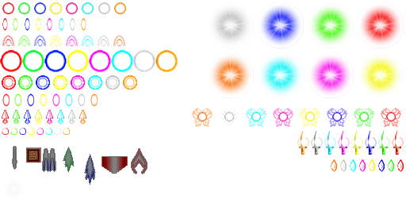

# オブジェクト生成
それでは、今まで画面上には自機しかいませんでしたが、今度は、自機が撃つ弾と、それから敵を出現させたいと思います。

## オブジェクトベース クラスの作成
今まで画面上のオブジェクトの1つとしてキャラクラスを作ってきました。そこに追加で、ショットクラスを追加します。
オブジェクトクラスとして共通している処理は、オブジェクトベースクラスに切り出して、
キャラクラスと、ショットクラスは、オブジェクトベースクラスを継承するようにしてしまいましょう。

`src/js/util.js`
```
'use strict';
var Util = function (){};
Util.inherit = function( child, parent ) {
	var getPrototype = function(p) {
		if(Object.create) return Object.create(p);

		var F = function() {};
		F.prototype = p;
		return new F();
	};
	child.prototype = getPrototype(parent.prototype);
	child.prototype.constructor = child;
};
module.exports = Util;
```

`src/object/base.js`
```
var id = 0;

var ObjectBase = function (scene) {
	this.scene = scene;
	this.game = game;

	this._id = ++id;

	this.x = 0;
	this.y = 0;

	// 経過フレーム数
	this.frame_count = 0;

	// 現在表示するスプライト
	this.current_sprite_index = 0;
};
ObjectBase.prototype.id = function () {
	return this._id;
};
// 更新
ObjectBase.prototype.update = function () {
	this.frame_count++;

	// animation sprite
	if(this.frame_count % this.spriteAnimationSpan() === 0) {
		this.current_sprite_index++;
		if(this.current_sprite_index >= this.spriteIndices().length) {
			this.current_sprite_index = 0;
		}
	}

};
// 描画
ObjectBase.prototype.draw = function () {
	var image = this.core.image_loader.getImage(this.spriteName());

	var ctx = this.core.ctx;

	ctx.save();

	// set position
	ctx.translate(this.x, this.y);

	var sprite_width  = this.spriteWidth();
	var sprite_height = this.spriteHeight();

	ctx.drawImage(
		image,
		// sprite position
		sprite_width * this.spriteIndexX(), sprite_height * this.spriteIndexY(),
		// sprite size to get
		sprite_width,                       sprite_height,
		// adjust left x, up y because of x and y indicate sprite center.
		-sprite_width/2,                    -sprite_height/2,
		// sprite size to show
		sprite_width,                       sprite_height
	);
	ctx.restore();
};

ObjectBase.prototype.spriteName = function(){
	throw new Error("must be implemented");
};
ObjectBase.prototype.spriteIndexX = function(){
	return this.spriteIndices()[this.current_sprite_index].x;
};
ObjectBase.prototype.spriteIndexY = function(){
	return this.spriteIndices()[this.current_sprite_index].y;
};
ObjectBase.prototype.spriteAnimationSpan = function(){
	throw new Error("must be implemented");
};
ObjectBase.prototype.spriteIndices = function(){
	throw new Error("must be implemented");
};
ObjectBase.prototype.spriteWidth = function(){
	throw new Error("must be implemented");
};
ObjectBase.prototype.spriteHeight = function(){
	throw new Error("must be implemented");
};
module.exports = ObjectBase;
```

`src/object/chara.js`
```
var Util = require("../util");
var ObjectBase = require("./base");
var Chara = function (scene) {
	ObjectBase.apply(this, arguments);
};
Chara.prototype.spriteName = function(){
	return "sanae";
};
Chara.prototype.spriteAnimationSpan = function(){
	return 10;
};
Chara.prototype.spriteIndices = function(){
	return [{x: 0, y: 0},{x: 1, y: 0}];
};
Chara.prototype.spriteWidth = function(){
	return 64;
};
Chara.prototype.spriteHeight = function(){
	return 64;
};
module.exports = Chara;
```

Util クラスは、ゲームに必要なユーティリティ関数をまとめた静的なクラスです。
JavaScript の継承はちょっと特殊なので、継承を行う inherit 関数を Util クラスに作ることにします。
`Util.inherit(child, parent)` で、親クラスのプロパティやメソッドを子クラスに継承することができます。

ObjectBase クラスは、キャラクラスやショットクラスが継承する基底クラスです。
先ほどの描画の項目などで記載した、スプライトアニメーションなどはここにまとめておきます。
(正確に言うと、スプライトを使わなかったり、スプライトのアニメーションをしないオブジェクトも今後増えていくので、
SpriteAnimationObjectBase といった名前が適切かと思いますが、
今回作るゲームの要件では、そこまで必要ではないので、このままで行こうと思います)

Chara クラスは、ObjectBase クラスを継承します。今まで Chara クラスに実装したほとんどの機能が、
ObjectBase クラスに移動したので、 Chara クラス自身は、スプライトの設定などの Chara 特有の設定を記載するのみになっています。

## ショット
それでは、ショットクラスを実装したいと思います。

**スプライト画像**  


http://danmakufu.wiki.fc2.com/wiki/%E7%B4%A0%E6%9D%90%E3%83%AA%E3%83%B3%E3%82%AF
弾画像
弾のズレが最も少ない画像。imgフォルダに入れるだけで使えるタイプ。
よりお借りしております。

# TODO:
image_loader を使って画像をロードしていない

`src/js/shot.js`
```
var Util = require("../util");
var ObjectBase = require("./base");
var Shot = function (scene, x, y) {
	ObjectBase.apply(this, arguments);

	this.x = x;
	this.y = y;
};
Shot.prototype.spriteName = function(){
	return "shot";
};
Shot.prototype.spriteAnimationSpan = function(){
	return 0;
};
Shot.prototype.spriteIndices = function(){
	return [{x: 0, y: 0}];
};
Shot.prototype.spriteWidth = function(){
	return 16;
};
Shot.prototype.spriteHeight = function(){
	return 16;
};
module.exports = Shot;
```

スプライトアニメーションを使用しないため、スプライトを1つだけ指定しています。

`src/js/object/chara.js`
```
Chara.prototype.update = function () {
	BaseObject.run.apply(this, arguments); // 親クラスの run を実行

	// Zが押下されていればショット生成
	if(this.core.isKeyDown(Constant.BUTTON_Z)) {
		this.scene.addObject(new Shot(this, this.x, this.y));
	}
};
```

先述の項目で述べた、プレイヤーからの入力を取得する方法に従い、
上記のように キャラクラス内で、プレイヤーの Z ボタンの押下を取得して、
shot オブジェクトを生成し、ステージに追加しています。

これで、Zボタンを押下することで、キャラが弾を撃つようになりました。しかし、
ショットの動きをまだ追加していないため、ステージ上の自機の位置にショットが
有り続けて、動かないと思います。これは、事項の移動の項目で修正いたします。

## 敵

敵クラスの作成も行います。これは、今までにやってきたことを通りで実装できます。

**スプライト画像**  


http://danmakufu.wiki.fc2.com/wiki/%E7%B4%A0%E6%9D%90%E3%83%AA%E3%83%B3%E3%82%AF
KMAPさんの素材詰め合わせ
KMAP -KUMAHACHAA PROJECT ver5.0.1-が ページ閲覧不能になったため再配布
ドット絵、カットイン画像多数あります。

よりお借りしております。

# TODO:
image_loader を使って画像をロードしていない

`src/js/enemy.js`
```
var Util = require("../util");
var ObjectBase = require("./base");
var enemy = function (scene, x, y) {
	ObjectBase.apply(this, arguments);

	this.x = x;
	this.y = y;
};
enemy.prototype.spriteName = function(){
	return "enemy";
};
enemy.prototype.spriteAnimationSpan = function(){
	return 0;
};
enemy.prototype.spriteIndices = function(){
	return [{x: 0, y: 0}, {x: 0, y: 1}, {x:0, y:2}];
};
enemy.prototype.spriteWidth = function(){
	return 16;
};
enemy.prototype.spriteHeight = function(){
	return 16;
};
module.exports = enemy;
```

敵の出現については、事項の敵マスターに委ねることにします。


## 敵マスター
敵の出現については、いつどこから出現するのかのロジックを考えて実装しなくてはなりません。

こうしたロジックについて、敵マスターを作成し、敵マスターに任せることにしたいと思います。

`src/js/master.js`
```
var Master = function (scene) {
	this.scene = scene;

	this.frame_count = 0;
};
Master.prototype.update = function () {
	this.frame_count++;

	if(this.frame_count % 100 === 0) {
		var x = Math.floor(Math.random() * this.core.width); // x軸はランダム
		var y = 0; // 画面上部から
		this.scene.addObject(new Enemy(this.scene, x, y));
	}
};
```

こうした敵を出現させる存在を、透明のオブジェクトとして扱うゲームエンジンも存在します。その方が、既存のオブジェクト管理の仕組みに乗っかって
実装できるので、楽なのですが、今回は、オブジェクトの仕組みに乗っからずに実装したいと思います。

出現ロジックは極めてシンプルです。100フレームごとに1つ、敵を出現させます。
出現位置は、画面上部のどこからかランダムです。

`src/js/scene/stage.js`
```
var StageScene = function (game) {
	/* ~ 以上省略 */
	this.master = new Master(this);
};
// 更新
StageScene.prototype.update = function () {
	this.frame_count++;

	this.updateObjects();

	this.master.update(); // 追加
};
```

Stage クラスにて、Master の追加及びフレームごとの実行のコードを追加します。
