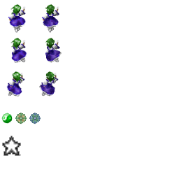

# 描画
ここまでで、シーン及びシーン内にオブジェクトを追加しました。シーンやオブジェクトを追加したにも関わらず、画面には何も表示されずに寂しかったことと思います。いよいよ画面の描画について書いていきます。
## 画像の読み込み
まずは、画像をゲームに読み込む処理をしたいと思います。JavaScript は非同期なので、
画像を読み込みしている最中も処理が進行します。画像の読み込みをしている間は、
ゲームを進行させない(=ローディング画面を表示する)ようにしないと、画像が表示されないまま
ゲームが進行してしまいます。

`src/asset_loader/image.js`
```
var ImageLoader = function(game) {
	this.images = {};

	this.loading_image_num = 0;
	this.loaded_image_num = 0;
};
ImageLoader.prototype.loadImage = function(name, path) {
	var self = this;

	self.loading_image_num++;

	// it's done to load image
	var onload_function = function() {
		self.loaded_image_num++;
	};

	var image = new Image();
	image.src = path;
	image.onload = onload_function;
	this.images[name] = image;
};

ImageLoader.prototype.isAllLoaded = function() {
	return this.loaded_image_num > 0 && this.loaded_image_num === this.loading_image_num;
};

ImageLoader.prototype.get = function(name) {
	return this.images[name];
};
ImageLoader.prototype.remove = function(name) {
	delete this.images[name];
};


module.exports = ImageLoader;
```

```
var ImageLoader = function(game) {
	this.images = {};

	this.loading_image_num = 0;
	this.loaded_image_num = 0;
};
```

ImageLoader クラスのコンストラクタです。読み込んだ画像データを保持する `images` プロパティ、
読み込み中の画像の数である `loading_image_num`, 読み込んだ画像数である `loaded_image_num` を持ちます。

```
ImageLoader.prototype.loadImage = function(name, path) {
	var self = this;

	self.loading_image_num++;

	// it's done to load image
	var onload_function = function() {
		self.loaded_image_num++;
	};

	var image = new Image();
	image.src = path;
	image.onload = onload_function;
	this.images[name] = image;
};
```

画像の読み込みを開始します。

```
ImageLoader.prototype.isAllLoaded = function() {
	return this.loaded_image_num > 0 && this.loaded_image_num === this.loading_image_num;
};
```

画像の読み込みが完了したことをチェックするメソッドです。プログラム側で、画像データが必要になった場合、
まず `loadImage` メソッドにより、画像の読み込みを開始し、シーン側で、`isAllLoaded` 関数が true になるまで、
他のゲームの進行をストップする(=ローディング画面を表示する)必要があります。

```
ImageLoader.prototype.get = function(name) {
	return this.images[name];
};
```

読み込みした画像データを取得するメソッドです。

```
ImageLoader.prototype.remove = function(name) {
	delete this.images[name];
};
```

読み込んだ画像を破棄するメソッドです。小さなゲームであれば、画像を破棄する必要はありませんが、
大きな規模のゲームでは、必要のなくなった画像は破棄しなくては、メモリを大量に消費してしまいます。

## スプライト

スプライトとは、複数の画像データを一つの画像ファイルにまとめたものです。同じ画像データでも、複数の画像ファイルを読み込むのと、1つのファイルで読み込んで、プログラム内で分割して使うのとでは、後者の方が読み込み速度が早くなります。

一般的に、キャラのアニメーションなどに使用する画像ファイルや、敵の弾の種類は、一つの画像ファイルにまとめる傾向があります。

それでは、オブジェクトにスプライトを使用して、画像を表示するようにしてみましょう。

**スプライト画像**  


http://danmakufu.wiki.fc2.com/wiki/%E7%B4%A0%E6%9D%90%E3%83%AA%E3%83%B3%E3%82%AF
星蓮船自機ドット絵
霊夢・魔理沙・早苗の星蓮船風ドット絵
よりお借りしております。

`src/object/chara.js`
```
var Chara = function (scene) {
	this.scene = scene;
	this.game = game;

	this._id = "chara";

	this.x = 0;
	this.y = 0;

	// 経過フレーム数
	this.frame_count = 0;

	// 現在表示するスプライト
	this.current_sprite_index = 0;
};
Chara.prototype.id = function () {
	return this._id;
};
// 更新
Chara.prototype.update = function () {
	this.frame_count++;

	// animation sprite
	if(this.frame_count % this.spriteAnimationSpan() === 0) {
		this.current_sprite_index++;
		if(this.current_sprite_index >= this.spriteIndices().length) {
			this.current_sprite_index = 0;
		}
	}

};
// 描画
Chara.prototype.draw = function () {
	var image = this.core.image_loader.getImage(this.spriteName());

	var ctx = this.core.ctx;

	ctx.save();

	// set position
	ctx.translate(this.x, this.y);

	var sprite_width  = this.spriteWidth();
	var sprite_height = this.spriteHeight();

	ctx.drawImage(image,
		// sprite position
		sprite_width * this.spriteIndexX(), sprite_height * this.spriteIndexY(),
		// sprite size to get
		sprite_width,                       sprite_height,
		// adjust left x, up y because of x and y indicate sprite center.
		-sprite_width/2,                    -sprite_height/2,
		// sprite size to show
		sprite_width,                       sprite_height
	);
	ctx.restore();
};

Chara.prototype.spriteName = function(){
	return "sanae";
};
Chara.prototype.spriteIndexX = function(){
	return this.spriteIndices()[this.current_sprite_index].x;
};
Chara.prototype.spriteIndexY = function(){
	return this.spriteIndices()[this.current_sprite_index].y;
};
Chara.prototype.spriteAnimationSpan = function(){
	return 1;
};
Chara.prototype.spriteIndices = function(){
	return [{x: 0, y: 0},{x: 0, y: 1}];
};
Chara.prototype.spriteWidth = function(){
	return 64;
};
Chara.prototype.spriteHeight = function(){
	return 64;
};
module.exports = Chara;
```

先ほど紹介した Chara クラスを改良しました。それではコードを追っていきましょう。

# TODO:
```
var Chara = function (scene) {
	this.scene = scene;
	this.game = game;

	this._id = "chara";

	this.x = 0;
	this.y = 0;

	// 経過フレーム数
	this.frame_count = 0;

	// 現在表示するスプライト
	this.current_sprite_index = 0;
};
```

``
// 更新
Chara.prototype.update = function () {
	this.frame_count++;

	// animation sprite
	if(this.frame_count % this.spriteAnimationSpan() === 0) {
		this.current_sprite_index++;
		if(this.current_sprite_index >= this.spriteIndices().length) {
			this.current_sprite_index = 0;
		}
	}

};
```

```
// 描画
Chara.prototype.draw = function () {
	var image = this.core.image_loader.getImage(this.spriteName());

	var ctx = this.core.ctx;

	ctx.save();

	// set position
	ctx.translate(this.x, this.y);

	var sprite_width  = this.spriteWidth();
	var sprite_height = this.spriteHeight();

	ctx.drawImage(image,
		// sprite position
		sprite_width * this.spriteIndexX(), sprite_height * this.spriteIndexY(),
		// sprite size to get
		sprite_width,                       sprite_height,
		// adjust left x, up y because of x and y indicate sprite center.
		-sprite_width/2,                    -sprite_height/2,
		// sprite size to show
		sprite_width,                       sprite_height
	);
	ctx.restore();
};
```

```
Chara.prototype.spriteName = function(){
	return "sanae";
};
```

```
Chara.prototype.spriteIndexX = function(){
	return this.spriteIndices()[this.current_sprite_index].x;
};
Chara.prototype.spriteIndexY = function(){
	return this.spriteIndices()[this.current_sprite_index].y;
};
```
```
Chara.prototype.spriteAnimationSpan = function(){
	return 1;
};
```
```
Chara.prototype.spriteIndices = function(){
	return [{x: 0, y: 0},{x: 0, y: 1}];
};
```
```
Chara.prototype.spriteWidth = function(){
	return 64;
};
Chara.prototype.spriteHeight = function(){
	return 64;
};
```

## スプライトアニメーション


